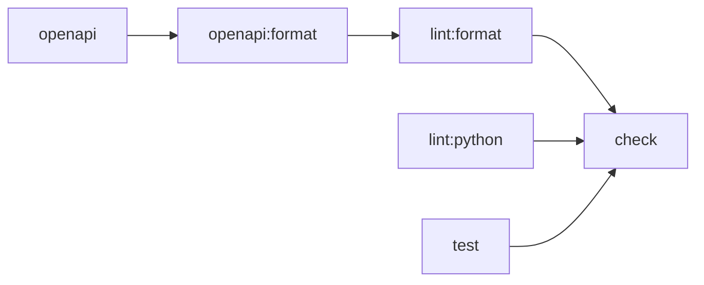

この記事では、mise tasksが現在どこまで開発用コマンドを管理できるのかを確認します。
前の記事で用意したPythonとuv、Node.jsとpnpmを使うFastAPIプロジェクトへ、
OpenAPI定義を生成する処理を追加します。
`task`の引数、依存関係、並列実行、`sources`と`outputs`による実行の省略などを、
実際のコマンドと出力を見ながら確認します。

手元での確認は、2026-08-29にmacOS arm64上で、fish 3.7.1とmise 2026.8.14を使って行いました。
Pythonは3.13.15、uvは0.12.5、Node.jsは24.19.0、pnpmは10.34.5です。
既存のグローバル設定やキャッシュの影響を避けるため、
検証時はmise、uv、pnpmが設定やキャッシュを保存するディレクトリを一時ディレクトリへ分けました。
これは記事の検証時だけに行った設定であり、通常の利用には必要ありません。

本文は公式ドキュメントと、実際の実行内容を元に記述しています。
正確な仕様や最新の挙動は、リンク先の公式ドキュメントと公式リポジトリの実装を確認してください。

## はじめに

前の記事では、チーム開発へ参加した人がリポジトリを`clone`した後、
`mise install`と`mise run setup`で開発環境を用意する流れを確認しました。
Ruff、pytest、Prettierは`mise run check`からまとめて実行し、GitHub Actionsからも同じ`task`を呼び出しています。

@[card](https://zenn.dev/yutaro1985/articles/mise-team-python-uv-pnpm)

前の記事では、Ruff、pytest、Prettierを実行する`task`を`mise.toml`へ定義しました。
各`task`の`run`にコマンドを書き、`check`の`depends`へ`lint`と`test`を指定することで、
`mise run check`からまとめて実行しています。

開発用コマンドが増えてくると、たとえば次のようなことも考える必要があります。

- pytestで実行するテストファイルを引数で指定したい
- FastAPIのコードや依存パッケージが変わっていない場合はOpenAPI定義を生成し直したくない
- pytest、Ruff、OpenAPI定義の生成を依存関係がない範囲で並行して実行したい
- 数行にわたる生成処理は`mise.toml`の外にスクリプトとして置きたい
- `task`の参照先や依存関係の誤りを実行前に確認したい

今回は、FastAPIからOpenAPI定義をYAMLで生成し、Prettierで整形した結果を確認する処理を追加します。
この例を使い、生成処理を必要なときだけ実行できるか、Ruffやpytestと並行して動かせるかを確認します。
ローカルとCIで同じ`check`を使えるかも見ていきます。

## 今回確認するmise tasksの機能

miseの`task`は、`mise.toml`の`[tasks]`へ定義できます。
別の方法として、`.mise/tasks`または`mise-tasks`へ実行可能なスクリプトを置くFile Tasksがあります。
File Tasksでは、ファイル名が`task`名になります[^file-tasks]。

どちらの方法で定義した`task`も、`mise.toml`で管理しているツールと環境変数を利用できます[^tasks]。

この記事で詳しく確認するものは次のとおりです。

| 機能 | どのような機能か | 今回使う場面 |
| --- | --- | --- |
| `usage` | `task`の引数、`help`、`shell completion`を1つの定義にまとめる | pytestの実行対象を引数で受け取る |
| `depends` | 現在の`task`より先に完了させる`task`を指定する | OpenAPI定義の生成、整形、確認の順番を定義する |
| 並列実行 | 依存関係を満たした`task`を同時に実行する | Ruff、pytest、OpenAPI定義の生成を並行して実行する |
| `sources`と`outputs` | `sources`に指定したファイルより`outputs`に指定した生成物が新しければ、`task`の実行を省略する | OpenAPI定義を生成し直す必要があるか判断する |
| File Tasks | 所定のディレクトリに置いた実行可能なスクリプトを`task`として扱う | Pythonで書いた生成処理を`mise.toml`の外へ置く |
| `mise tasks validate` | `task`の参照先、循環した依存関係、`usage`などの設定を検証する | `check`を実行する前に設定ミスを確認する |
| `mise tasks deps` | `task`間の依存関係をツリーで表示する | `check`から実行される`task`を確認する |
| Sandboxingの`deny_net` | OSの機能を使い、その`task`からのネットワーク接続を禁止する | `openapi:format`からのネットワーク接続を禁止する |

mise tasksには、このほかにもファイル監視、Task Templates、モノレポでプロジェクトごとの`task`を区別する機能などがあります。
今回の例で使わなかった機能は、後半で用途と合わせて触れます。

## YAML形式のOpenAPI定義を使った`task`の構成

OpenAPIはHTTP APIのエンドポイントやリクエスト、レスポンスの形式を記述する仕様です。
FastAPIは登録されたルートからOpenAPI定義を生成する`app.openapi()`を備えています[^openapi][^fastapi-openapi]。

OpenAPI文書はJSONとYAMLのどちらでも記述できます。
今回は、生成結果をPull Requestで確認しやすいようにYAMLで保存します。
FastAPIのコードが変わると生成結果も変わるため、`sources`と`outputs`の動作を確認する例としても使えます。
生成したYAMLをPrettierで整形すれば、
OpenAPI定義を生成する`task`と整形する`task`の依存関係を`depends`で定義する例にもなります。

前の記事で作ったFastAPIプロジェクトへ、次のファイルと処理を追加しました。
`task`を実行した後の主なファイルは次のとおりです。

```text
.
├── .mise
│   └── tasks
│       └── openapi
├── .generated
│   └── openapi.raw.yaml
├── .gitignore
├── app.py
├── mise.toml
├── openapi.yaml
├── package.json
├── pnpm-lock.yaml
├── pyproject.toml
└── uv.lock
```

`.generated/openapi.raw.yaml`は整形前の一時ファイルです。
`.generated/`を`.gitignore`へ追加します。
整形した`openapi.yaml`は、APIの変更をPull Requestで確認できるようにGitで管理します。

前の記事では`/health`だけでしたが、今回は`/version`も追加しました。

```python
@app.get("/version")
def version() -> dict[str, str]:
    return {"version": "1"}
```

YAMLへの書き出しにはPyYAMLを使います。
今回は、前の記事で作った`pyproject.toml`の開発用依存パッケージへPyYAMLを追加し、`uv.lock`を更新しました[^pyyaml]。

```toml
[dependency-groups]
dev = [
  "pytest>=8,<10",
  "pyyaml>=6,<7",
  "ruff>=0.12,<1",
]
```

`package.json`の`scripts`には、YAML形式のOpenAPI定義を整形するコマンドを追加します。
`--stdin-filepath openapi.yaml`を指定すると、Prettierは標準入力の内容を`openapi.yaml`として扱います。
miseからは`pnpm run openapi:format`を呼び出します[^prettier-cli]。

```json
{
  "scripts": {
    "openapi:format": "prettier --stdin-filepath openapi.yaml < .generated/openapi.raw.yaml > openapi.yaml",
    "format:check": "prettier --check README.md package.json openapi.yaml"
  }
}
```

`pyproject.toml`と`package.json`を変更した後に`mise run setup`を実行し、PyYAMLとPrettierをインストールしました。
以降の実行結果は、この準備を終えた状態で確認しています。

### File TasksでYAML形式のOpenAPI定義を生成する

OpenAPI定義の生成処理は複数行のPythonコードになるため、
`mise.toml`の`run`へ埋め込まず、`.mise/tasks/openapi`へ分けました。
このように処理をスクリプトへ分けると、TOML内の文字列として書く場合より、
エディタや`linter`から扱いやすくなります。
拡張子のないファイルをPythonとして認識できるかは、エディタや`linter`の設定によります。
miseは`.mise/tasks/openapi`というファイル名から`openapi`という`task`として検出し、`mise run openapi`で実行します[^file-tasks]。

```python
#!/usr/bin/env -S uv run --locked python
#MISE description="FastAPIからOpenAPI定義をYAMLで生成する"
#MISE sources=["app.py", "pyproject.toml", "uv.lock"]
#MISE outputs=[".generated/openapi.raw.yaml"]
#MISE env={PYTHONPATH="."}

from pathlib import Path

import yaml

from app import app

output = Path(".generated/openapi.raw.yaml")
output.parent.mkdir(exist_ok=True)
output.write_text(
    yaml.safe_dump(app.openapi(), allow_unicode=True, sort_keys=False),
    encoding="utf-8",
)
print(f"generated {output}")
```

先頭の`shebang`では、この`task`をuvで用意したPythonから実行するように指定しています。
File Tasksでは、`#MISE`で始まる行に`description`、`sources`、`outputs`、環境変数などを書けます。
`PYTHONPATH`にはプロジェクトのルートディレクトリを指定し、
`.mise/tasks`にあるPythonスクリプトから`app.py`を読み込めるようにしています。

macOSやLinuxでは、File Tasksとして置くファイルに実行権限が必要です[^file-tasks]。

```shell
chmod +x .mise/tasks/openapi
```

`# MISE`のように空白を入れた表記は設定として認識されません。
フォーマッターが`#MISE`を書き換える場合は、公式ドキュメントにある`# [MISE]`も使えます[^file-tasks]。

### `depends`で生成と整形の順番を指定する

`min_version = "2026.8.14"`、ツール、環境変数は前の記事と同じです。
`task`は次のように変更しました。

```toml
[tasks.setup]
description = "uvとpnpmで依存パッケージをインストールする"
run = [
  "uv sync --locked",
  "pnpm install --frozen-lockfile",
]

[tasks.test]
description = "pytestの実行対象を指定してテストする"
usage = '''
arg "[target]" help="pytestの実行対象" default="tests"
complete "target" run="find tests -type f -name 'test_*.py' -print"
'''
run = 'uv run --locked python -m pytest -q "${usage_target?}"'

[tasks."lint:python"]
description = "RuffでPythonを確認する"
run = "uv run --locked ruff check ."

[tasks."openapi:format"]
description = "生成したOpenAPIをPrettierで整形する"
depends = ["openapi"]
run = "pnpm --silent run openapi:format"
sources = [".generated/openapi.raw.yaml", "package.json", "pnpm-lock.yaml"]
outputs = ["openapi.yaml"]
deny_net = true

[tasks."lint:format"]
description = "PrettierとOpenAPI定義を確認する"
depends = ["openapi:format"]
run = [
  "pnpm --silent run format:check",
  "git diff --exit-code -- openapi.yaml",
]

[tasks.check]
description = "Python、文書、生成物、テストをまとめて確認する"
depends = ["lint:python", "lint:format", "test"]
```

`openapi:format`はFile Tasksで定義した`openapi`へ依存します。
`lint:format`は整形後の`openapi.yaml`を確認するため、`openapi:format`へ依存させました。
Prettierによる整形結果の確認後、`git diff --exit-code`でGitに記録した`openapi.yaml`との差分も確認します。
FastAPIの変更によって生成物にも差分が出たのにもかかわらず、
生成したOpenAPI定義をコミットし忘れた場合は、このコマンドが失敗します。

`depends`で指定した順番を、`task`が実行される向きに並べると次のようになります。



矢印の左側にある`task`が完了すると、右側の`task`を実行できます。
`openapi`、`lint:python`、`test`の間には依存関係がないため、これらは並行して実行されます。
PrettierとGitによる確認は、OpenAPI定義の生成と整形が終わってから実行されます。

## `mise tasks validate`と`mise tasks deps`で設定を確認する

最初に、存在しない`task`を参照していないか、依存関係が循環していないかを確認します。
`usage`の定義も検証されます[^task-validate]。

```shell
mise tasks validate
```

```text
✓ All 7 task(s) validated successfully
```

次に、`check`から実行される`task`の依存関係を表示します[^task-deps]。

```shell
mise tasks deps check
```

```text
check
├── test
├── lint:format
│   └── openapi:format
│       └── openapi
└── lint:python
```

Mermaidの図は、`task`が実行される順番に矢印を向けています。
`mise tasks deps`は、指定した`task`を起点として、先に実行する`task`をその下へ表示します。

`mise tasks deps`は、`depends`、`depends_post`、`wait_for`で定義した`task`の依存関係を表示します。

## `usage`で`task`の引数を定義する

`test`の`task`では、pytestの実行対象を`target`という引数で受け取ります。
引数を省略した場合は、`tests`が使われます。

`mise.toml`の`test`には、次のように`usage`を定義しました。

```toml
[tasks.test]
usage = '''
arg "[target]" help="pytestの実行対象" default="tests"
complete "target" run="find tests -type f -name 'test_*.py' -print"
'''
```

`usage`を定義すると、引数の解析だけでなく、`help`と`shell completion`にも同じ定義を使えます。
現在の公式ドキュメントでは、`task`の引数は`usage`で定義する方法が推奨されています[^task-arguments]。

```shell
mise run test --help
```

```text
pytestの実行対象を指定してテストする

Usage: test [target]

Arguments:
  [target]  pytestの実行対象
            (default: tests)

Flags:
  -h, --help  Print help
```

テスト対象のファイルを指定して実行します。

```shell
mise run test tests/test_app.py
```

```text
[test] $ uv run --locked python -m pytest -q "${usage_target?}"
[test] .                                                                        [100%]
[test] 1 passed in 0.09s
[test] Finished in 226.8ms
```

`complete`には、補完候補を返すコマンドを書いています。
手元のfishでは、miseの`shell completion`を読み込んだ状態で`tests/test_app.py`が候補に表示されました。
bash、zsh、fishのいずれでも、
`task`の補完を使うにはmiseの`shell completion`をインストールまたは読み込んでおく必要があります。

## `depends`に従って`task`を並列実行する

miseは、依存関係を満たしている`task`を並行して実行します。
標準では最大4つで、`--jobs`や設定値から変更できます[^running-tasks]。

今回の`check`の`task`では、`test`、`lint:python`、`openapi`の間に依存関係はありません。
そのため、pytest、Ruff、OpenAPI定義の生成を並行して実行できます。
`openapi:format`は`openapi`の完了を待ち、`lint:format`は`openapi:format`の完了を待ちます。

生成物がない状態で`check`の`task`を実行してみます。
出力へ`task`名を付け、実行順が分かる行を`grep`で取り出しました。
`sed`は、検証用ディレクトリの絶対パスを相対パスへ置き換えるために使っています。

```shell
mise run --output prefix check > /tmp/mise-tasks-check.log 2>&1
sed "s|$PWD/||" /tmp/mise-tasks-check.log | grep -E '^\[(openapi|openapi:format|lint:python|lint:format|test)\] (\$|generated|All checks passed!|All matched files use Prettier code style!|[0-9]+ passed in)'
```

```text
[lint:python] $ uv run --locked ruff check .
[openapi] $ .mise/tasks/openapi
[test] $ uv run --locked python -m pytest -q "${usage_target?}"
[lint:python] All checks passed!
[openapi] generated .generated/openapi.raw.yaml
[openapi:format] $ pnpm --silent run openapi:format
[test] 1 passed in 0.10s
[lint:format] $ pnpm --silent run format:check
[lint:format] All matched files use Prettier code style!
[lint:format] $ git diff --exit-code -- openapi.yaml
```

pytest、Ruff、OpenAPI定義の生成は、ほかの`task`の完了を待たずに始まりました。
OpenAPI定義が生成された後に`openapi:format`が動き、最後に`lint:format`が実行されています。

変更せずにもう一度`check`を実行し、どの`task`が実行または省略されたか分かる行を取り出します。

```shell
mise run --output prefix check > /tmp/mise-tasks-check.log 2>&1
grep -E 'sources up-to-date|All checks passed!|passed in|All matched files use Prettier code style!' /tmp/mise-tasks-check.log
```

```text
[openapi] sources up-to-date, skipping
[openapi:format] sources up-to-date, skipping
[lint:python] All checks passed!
[lint:format] All matched files use Prettier code style!
[test] 1 passed in 0.10s
```

OpenAPI定義の生成と整形は省略されました。
それらへ依存する`lint:format`は実行され、Gitで管理する`openapi.yaml`を確認しています。

## `sources`と`outputs`で生成処理を省略する

`openapi`では、FastAPIのコードとPythonの設定、`lockfile`を`sources`へ指定しました。
生成するYAMLは`outputs`へ指定しています。
標準設定では、`sources`に指定したファイルのうち最も新しい更新日時と、`outputs`に指定した生成物のうち最も古い更新日時を比較します。
`outputs`に指定した生成物のほうが新しければ、`task`の実行を省略します。
`task`の定義自体も更新判定の入力として扱われます[^task-configuration]。

前の節までを順番に実行すると、YAML形式のOpenAPI定義はすでに生成されています。
生成物がない場合の動作を確認するため、Gitで管理していない整形前のYAMLを削除します。

```shell
rm .generated/openapi.raw.yaml
```

`openapi`を実行します。
出力には検証用ディレクトリの絶対パスも含まれるため、生成結果の行を`grep`で取り出します。

```shell
mise run openapi > /tmp/mise-openapi.log 2>&1
grep -E 'generated|sources up-to-date' /tmp/mise-openapi.log
```

```text
generated .generated/openapi.raw.yaml
```

ファイルを変更せずにもう一度実行します。

```shell
mise run openapi > /tmp/mise-openapi.log 2>&1
grep -E 'generated|sources up-to-date' /tmp/mise-openapi.log
```

```text
[openapi] sources up-to-date, skipping
```

標準設定が更新日時を比較していることを確認するため、`touch`コマンドで`app.py`の更新日時だけを変更します。
touchコマンドは空のファイルを作成したり、指定したファイルのタイムスタンプを更新したりするのに使うコマンドです。
これは検証のためで、実際の開発では`app.py`を編集すれば更新日時も変わります。

```shell
touch app.py
mise run openapi > /tmp/mise-openapi.log 2>&1
grep -E 'generated|sources up-to-date' /tmp/mise-openapi.log
```

```text
generated .generated/openapi.raw.yaml
```

更新日時に関係なく実行したい場合は、`task`名より前に`--force`を指定します。

```shell
mise run --force openapi > /tmp/mise-openapi.log 2>&1
grep -E 'generated|sources up-to-date' /tmp/mise-openapi.log
```

```text
generated .generated/openapi.raw.yaml
```

この判定は、`experimental`であるTask Output Cacheとは別の機能です。
`outputs`を省略した場合は、miseが内部ファイルへ実行時刻を記録する`outputs = { auto = true }`も使えます。

また、更新日時ではなく内容のハッシュで判定する`task.source_freshness_hash_contents`という設定もあります。
今回は標準設定の更新日時による判定だけを確認しました[^task-configuration-versioned]。

## Sandboxingの`deny_net`でネットワーク接続を禁止する

`openapi:format`では、`mise run setup`でインストールしたPrettierを使ってYAMLを整形します。
この処理にネットワーク接続は必要ないため、`deny_net = true`を指定しました。
miseは`openapi:format`から起動するプロセスのネットワーク接続を禁止します。

miseのSandboxingは、OSごとの機能を使ってファイルへのアクセス、ネットワーク接続、環境変数を制限します。
macOSでは`/usr/bin/sandbox-exec`が使われます。
Linuxでは、ファイルへのアクセスにLandlock、ネットワーク接続にseccomp-bpfが使われます。
Sandboxingはmise 2026.6.6で`experimental`から正式版になりました[^sandbox-release][^sandbox]。

`mise run`は、`[tools]`や`task`の`tools`に指定したツールが不足している場合、
標準設定では`task`のコマンドを始める前にインストールします[^task-auto-install]。

miseがNode.jsやpnpmをインストールする処理は、
`openapi:format`のSandboxingが適用される前に行われます[^task-install-order][^task-sandbox-order]。

一方、今回のPrettierは`package.json`の`devDependencies`で管理しています。
この記事の設定では、miseによるツールの自動インストールでプロジェクトのルートに`node_modules`は作られません。
そのために`setup`の`task`を定義しておいたので、先に`mise run setup`を実行しておく必要があります。
macOSやLinuxでは、`pnpm install`や`pnpm dlx`など、
`task`内のコマンドがネットワークからのダウンロードを試みた場合は`deny_net`によって失敗します。

`deny_net`を指定したのは`openapi:format`だけです。
依存先の`openapi`にはこの制限は適用されません。
先ほどの`check`の`task`では、`deny_net = true`を有効にしたまま`openapi:format`が完了しました。

WindowsではSandboxingが未対応で、警告を出した後に制限なしで`task`が実行されます。
macOSとLinuxでも制限方法や例外が異なります。
コンテナのように隔離する機能ではありません。
利用するOSによって挙動が異なるため、公式ドキュメントで確認してください。

## ローカルとCIから同じ`mise run check`を実行する

前の記事で作ったGitHub Actionsのワークフローは、`mise run check`を呼び出しています。
今回`task`の依存関係を増やしても、
ワークフローへRuff、pytest、OpenAPI定義の生成、Prettierのコマンドを個別に追加する必要はありません。
生成した`openapi.yaml`のコミット漏れも、`lint:format`から実行する`git diff --exit-code`で検出します。

GitHub Actionsでは、実行するトリガ、ランナー、権限、マトリックスなどを定義します。
開発時の確認内容と実行順はmiseの`task`へ書き、ローカルとCIから同じ`mise run check`を呼び出します。

ただし、miseを使わなくても、リポジトリ内のスクリプトをGitHub Actionsから呼び出せばコマンドの重複は減らせます。
GitHubの公式ドキュメントにも、ワークフローからスクリプトを実行する方法が記載されています[^github-actions-scripts]。

## mise tasksとほかの方法を使い分ける

ここまでの処理は、`package.json`の`scripts`やMakefile、シェルスクリプトでも実現できます。
mise tasksを使わなければできない処理ではありません。

今回mise tasksを使う理由は、`mise.toml`で管理しているPython、uv、Node.js、pnpmと環境変数を、
そのまま`task`でも使えるためです。
`uv run`で実行するpytestとpnpmで管理するPrettierを`mise run check`からまとめて実行できます。

Prettier本体はpnpmの開発用依存パッケージとして`package.json`と`pnpm-lock.yaml`で管理しています。
今回の`openapi:format`と`format:check`も`package.json`の`scripts`へ残しました。
すでに`scripts`で管理しているコマンドは、miseの`task`から`pnpm run`で呼び出せます。
今回の構成では、同じコマンドを`mise.toml`へ書き直す必要はありません[^pnpm-run]。
新しく開発用コマンドを定義する場合は、`package.json`の`scripts`で管理するか、
miseの`task`へ直接書くかをプロジェクトに合わせて選べます。

| 方法 | miseと組み合わせる場合 | その方法を中心にしたほうがよい場面 |
| --- | --- | --- |
| `package.json`の`scripts` | pnpmで管理するPrettierの実行コマンドは`scripts`へ残し、miseから`pnpm run`を呼ぶ | Node.jsだけで完結するリポジトリ |
| Makefile | 既存の`make check`をmiseの`task`から呼ぶ | パターンルールを多く使うビルドや、Makeによる依存関係の管理がすでに機能している場合 |
| シェルスクリプト | 複数行の処理をFile Tasksにするか、TOMLで定義した`task`から呼ぶ | 分岐が多く、独立したスクリプトとしてlintやテストを行いたい場合 |
| GitHub Actions | ワークフローから`mise run check`を呼ぶ | トリガ、権限、マトリックス、アーティファクトなどCI固有の処理 |

GNU Makeにも、依存関係と更新日時を元に再実行を判断する機能があります。
既存の`make check`で困っていない場合は、この機能のためだけにmiseへ置き換える必要はありません[^make]。

すでに別のタスクランナーやビルドシステムで依存関係やキャッシュを管理している場合も、
その処理をmiseへ移す必要はありません。
既存のコマンドをmiseの`task`から呼び、ツールのバージョンと環境変数だけをmiseで管理する使い方もできます。

自分の場合、Ruffとpytest、Prettierを`mise run check`からまとめて実行できる点が、mise tasksを使う一番大きな理由です。
また、新しく作るプロジェクトでは、必要な開発用コマンドをなるべくmiseの`task`へ書いています。

## 公式Cookbookにある利用例

公式Cookbookでは、Pythonプロジェクトの依存パッケージのインストール、アプリケーションの実行、テスト、lintを、
`task`として定義する例が紹介されています。
Node.jsの例には、依存パッケージのインストール、開発サーバ、lint、テスト、ビルドがあります。
pnpmを使う例では、`sources`と`outputs`を指定して、
入力が変わっていない場合に`pnpm install`を省略しています[^cookbook][^python-cookbook][^node-cookbook]。

本記事ではCookbookの例とは別に、実際にありそうなFastAPIでのOpenAPI生成からの流れを例として実施しています。

## 今回扱わなかったmise tasksの機能

今回の例だけでmise tasksの機能をすべて試すのは現実的でなかったため、その他の機能をまとめて紹介します。
使わなかった機能には、次のような用途が考えられます。

| 機能 | どのような機能か | 利用例 |
| --- | --- | --- |
| `mise watch` | ファイルの変更を監視し、指定した`task`を再実行するコマンドで、内部ではwatchexecを使う[^mise-watch] | `app.py`やテストファイルを変更したときに、pytestやOpenAPI定義の生成を再実行する |
| `depends_post` | 現在の`task`と依存する`task`が完了した後に実行する`task`を指定する[^task-configuration] | デプロイの後にクリーンアップを実行する |
| `wait_for` | 同じ`mise run`で対象の`task`も実行される場合だけ完了を待ち、`wait_for`だけでは実行対象に加えない | 生成する`task`とlintを同時に指定したときに、生成が終わってからlintを実行する |
| Task Templates | 共通する`task`の定義をテンプレートへ書き、各`task`が`extends`で継承する | 複数のサービスで共通するビルドやテストの設定をまとめる |
| Monorepo Tasks | `monorepo_root = true`を指定すると、サブディレクトリの`mise.toml`にある`task`を自動検出し、ルートからの相対パス付きで実行できる | `frontend`と`backend`の両方にある`test`を、`//frontend:test`と`//backend:test`として区別する |
| `confirm` | `task`自身の`run`を実行する前に確認メッセージを表示し、`depends`で指定した`task`はその前に実行する | デプロイを始める前に実行してよいか確認する |
| `timeout` | `task`の最大実行時間を指定し、その時間内に完了しなければ失敗させる | 長時間終わらない統合テストを中止する |
| Remote Tasks | `file`にHTTPのURLを指定し、取得したスクリプトを`task`として実行する | 取得したファイルが実行されるため配布元を信頼できる場合に、組織内で共通の`task`をHTTPから取得する[^remote-tasks] |

Task Templates、Monorepo Tasks、Sandboxingは、mise 2026.6.6で`experimental`から正式版になりました[^task-templates][^monorepo]。

Monorepo Tasksを使うには、モノレポのルートにある`mise.toml`で`monorepo_root = true`を指定します。
たとえば、`frontend/mise.toml`と`backend/mise.toml`にそれぞれ`test`を定義します。
これらはルートから`//frontend:test`と`//backend:test`として実行できます。
`mise tasks graph`は、`task`間ではなくワークスペース内のプロジェクト間の関係を表示する別のコマンドです。

記事執筆時点で最新のmise 2026.9.1では、`mise tasks graph`と`--affected`は`experimental`です。
Task Output CacheとGitリポジトリから取得するRemote Tasksも`experimental`です[^task-output-cache-versioned][^monorepo-versioned][^remote-tasks-versioned]。

仕様変更の可能性があるため、この記事では概要だけにとどめました。

## まとめ

開発用コマンドをmiseの`task`にまとめると、使用する言語やパッケージ管理方法が異なっていても、
チームでは`mise run check`を実行すればよくなります。
今回試した範囲では、Ruff、pytest、OpenAPI定義の生成、Prettierによる整形を同じコマンドから実行できる点が、
mise tasksを使う一番分かりやすい理由でした。

`depends`には実行順を、`sources`と`outputs`には再実行が必要か判断するためのファイルを指定しました。
設定した依存関係は`mise tasks validate`と`mise tasks deps`から確認できます。
依存関係のない`task`は並行して実行されるため、すべての処理を順番に待つ必要もありません。

既存の開発用コマンドをすべて`mise.toml`へ移す必要はありません。
今回はPrettierのコマンドを`package.json`の`scripts`へ残し、miseの`task`から呼び出しました。
GitHub Actionsにも個別のコマンドを重ねて書かず、ローカルと同じ`mise run check`を使っています。

[^tasks]: [Tasks | mise-en-place](https://mise.jdx.dev/tasks/)
[^file-tasks]: [File Tasks | mise-en-place](https://mise.jdx.dev/tasks/file-tasks.html)
[^openapi]: [OpenAPI Specification v3.1.0](https://spec.openapis.org/oas/v3.1.0.html)
[^fastapi-openapi]: [Extending OpenAPI | FastAPI](https://fastapi.tiangolo.com/how-to/extending-openapi/)
[^pyyaml]: [PyYAML Documentation](https://pyyaml.org/wiki/PyYAMLDocumentation)
[^prettier-cli]: [CLI | Prettier](https://prettier.io/docs/cli#--stdin-filepath)
[^task-validate]: [mise tasks validate | mise-en-place](https://mise.jdx.dev/cli/tasks/validate.html)
[^task-deps]: [mise tasks deps | mise-en-place](https://mise.jdx.dev/cli/tasks/deps.html)
[^task-arguments]: [Task Arguments | mise-en-place](https://mise.jdx.dev/tasks/task-arguments.html)
[^running-tasks]: [Running Tasks | mise-en-place](https://mise.jdx.dev/tasks/running-tasks.html)
[^task-configuration]: [Task Configuration | mise-en-place](https://mise.jdx.dev/tasks/task-configuration.html)
[^task-configuration-versioned]: [task.source_freshness_hash_contentsの設定 | mise v2026.9.1](https://github.com/jdx/mise/blob/v2026.9.1/settings.toml#L3231-L3235)
[^task-output-cache-versioned]: [Task Output Cache | mise v2026.9.1](https://github.com/jdx/mise/blob/v2026.9.1/docs/tasks/task-configuration.md#L622-L642)
[^sandbox-release]: [mise v2026.6.6](https://github.com/jdx/mise/releases/tag/v2026.6.6)
[^sandbox]: [Sandboxing | mise-en-place](https://mise.jdx.dev/sandboxing.html)
[^task-auto-install]: [tool自動インストールの設定 | mise v2026.8.14](https://github.com/jdx/mise/blob/v2026.8.14/settings.toml#L258-L262)、[task実行時の自動インストール設定 | mise v2026.8.14](https://github.com/jdx/mise/blob/v2026.8.14/settings.toml#L3119-L3123)
[^task-install-order]: [toolのインストールからtaskを実行するまでの処理 | mise v2026.8.14](https://github.com/jdx/mise/blob/v2026.8.14/src/cli/run.rs#L772-L877)
[^task-sandbox-order]: [Sandboxingを適用してtaskを起動する処理 | mise v2026.8.14](https://github.com/jdx/mise/blob/v2026.8.14/src/task/task_executor.rs#L1854-L1860)
[^github-actions-scripts]: [Adding scripts to your workflow | GitHub Docs](https://docs.github.com/en/actions/how-tos/write-workflows/choose-what-workflows-do/add-scripts)
[^pnpm-run]: [pnpm run | pnpm](https://pnpm.io/cli/run)
[^make]: [GNU make manual](https://www.gnu.org/software/make/manual/make.html)
[^cookbook]: [Cookbook | mise-en-place](https://mise.jdx.dev/mise-cookbook/)
[^python-cookbook]: [Mise + Python Cookbook | mise-en-place](https://mise.jdx.dev/mise-cookbook/python.html)
[^node-cookbook]: [Mise + Node.js Cookbook | mise-en-place](https://mise.jdx.dev/mise-cookbook/nodejs.html)
[^mise-watch]: [mise watch | mise-en-place](https://mise.jdx.dev/cli/watch.html)
[^task-templates]: [Task Templates | mise-en-place](https://mise.jdx.dev/tasks/templates.html)
[^monorepo]: [Monorepo Tasks | mise-en-place](https://mise.jdx.dev/tasks/monorepo.html)
[^remote-tasks]: [Remote Tasks | mise-en-place](https://mise.jdx.dev/tasks/toml-tasks.html#remote-tasks)
[^monorepo-versioned]: [Workspace Project GraphとAffected Tasks | mise v2026.9.1](https://github.com/jdx/mise/blob/v2026.9.1/docs/tasks/monorepo.md#L336-L386)
[^remote-tasks-versioned]: [Gitから取得するRemote Tasks | mise v2026.9.1](https://github.com/jdx/mise/blob/v2026.9.1/docs/tasks/toml-tasks.md#L391-L440)
